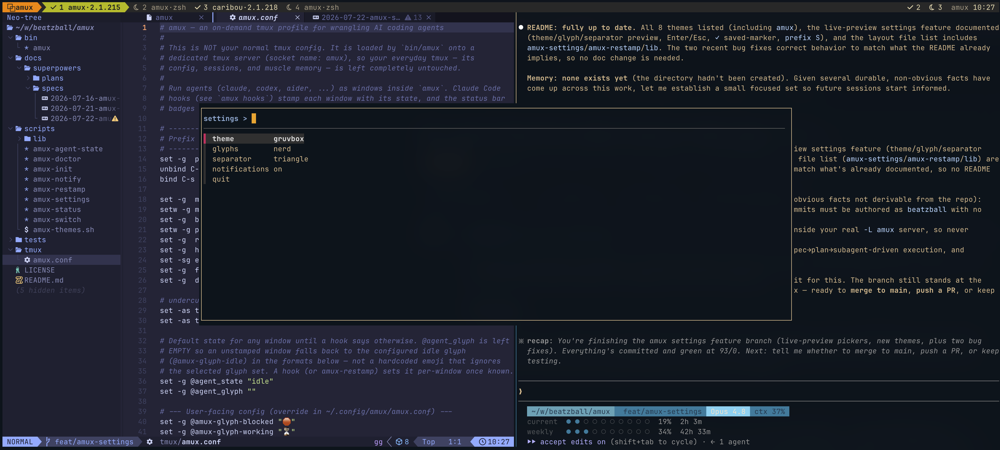

# roost

```
░░                                        ░░
░░░                                      ░░░
░░░░░░           ░░░░░░░░░░           ░░░░░░
░░░░░░░░░   ░░░░░░░░░░░░░░░░░░░░   ░░░░░░░░░
 ░░░░░░░░░░░░░░░░░░░░░░░░░░░░░░░░░░░░░░░░░░
  ░░░░░░░░░░░░░░░░░░░░░░░░░░░░░░░░░░░░░░░░
    ▒░░░░░░░░░░░░░░░░░░░░░░░░░░░░░░░░░░▒
   ▒▒▒▒▒▒░░░░░░░░░░░░▒▒░░░░░░░░░░░░▒▒▒▒▒▒
  ▒▒▒▒▒▒   ▒▒▒▒░░░░░░░░░░░░░░▒▒▒▒   ▒▒▒▒▒▒
  ▒▒▒▒▒   ▒▒▒▓▒▒▒▒░░░░░░░░▒▒▒▒▓▒▒▒   ▒▒▒▒▒
  ▒▒▒▒▒   ▒▒▒▒▒▓▓▓▒▒░░▒░▒▒▓▓▓▒▒▒▒▒   ▒▒▒▒▒
  ▒▒▒▒▒    ▒▒▒▒▒▒▓▓▓▒▒▒▒▓▓▓▒▒▒▒▒▒    ▒▒▒▒▒
  ▒▒▓▒▒▒     ▒▒▒▒▒  ▓▒▒▓  ▒▒▒▒▒     ▒▒▒▓▒▒
   ▒▒▓▓▓▒            ▒▒            ▒▓▓▓▒▒
   ▒▒▒▒▒▓▓                        ▓▓▒▒▒▒▒
     ▒▒▒▒▒▒▒▒       ░░▒▒       ▒▒▒▒▒▒▒▒
       ▒▒▒░░░▒▒░░ ░░░░▒▒▒░ ░░▒▒░░░▒▒▒
         ░░░░░░░░░░░░░░░▒▒░░░░░░░░░
              ░░░░░▒░░░░▒░░░░░
                   ░▒░░▒░
                     ░░
```

<div align="center">

[](https://github.com/beatzball/roost/actions/workflows/ci.yml)
[](https://github.com/tmux/tmux/wiki)
[](LICENSE)
[](docs/known-gaps.md)
[](https://roosting.dev)

</div>

An on-demand tmux **agent view** for wrangling multiple AI coding agents —
without giving up your normal tmux setup or switching to a different terminal.

`roost` runs on its **own isolated tmux server** with its own config, so your
everyday `tmux` (config, sessions, plugins, muscle memory) is **never touched**.
Launch it with one command, run your agents as panes or windows inside it,
and each is badged with what its agent is doing:

> 💥 error / needs you · 🛑 blocked / needs you · ⏳ working · ✅ done · 💤 idle

State comes from **each agent's own lifecycle events** — Claude Code hooks, the
opencode plugin, the GitHub Copilot CLI extension, or one `roost state` call
from anything else — not from scraping process names or terminal output, so it's
accurate rather than guessed. No compiled binary, nothing that reaches into
`~/.tmux.conf`.


## 📖 Full documentation: [roosting.dev](https://roosting.dev)

Setup, key bindings, driving a fleet of agents, wiring the state badges, and
troubleshooting all live there. What follows is the short version plus what you
need to hack on roost itself.

## Requirements

- `tmux` ≥ 3.2 (needs pane options, `#{P:}` pane loops, and `display-popup`)
- `git`
- A powerline/Nerd Font for the tab separators — or run `roost init` and pick
  the plain-separator fallback
- An agent that can report its state, for the badges — Claude Code, opencode or
  GitHub Copilot CLI have adapters in this repo; anything else calls `roost
  state`. The view itself works without any of them
- Optional: `fzf` (for the `prefix a` agent switcher)

## Install

```sh
curl -fsSL https://raw.githubusercontent.com/beatzball/roost/main/install.sh | sh
```

That clones roost to `~/.local/share/roost` and adds its `bin/` to your `PATH`.
It works out which startup file your shell actually reads — `.zshrc` for zsh
(honouring `ZDOTDIR`), `.bash_profile` or `.bashrc` for bash depending on your
platform, `config.fish` for fish — and refuses to add the same line twice.

Options:

```sh
./install.sh --dir ~/tools/roost   # clone somewhere else
./install.sh --symlink             # symlink bin/roost into a PATH dir instead
./install.sh --dry-run             # print what it would do, change nothing
```

Prefer to do it by hand? roost is just a script:

```sh
git clone https://github.com/beatzball/roost.git roost
export PATH="$PWD/roost/bin:$PATH"   # add to your shell's startup file
```

The launcher resolves its own location (following symlinks), so it finds its
config and scripts no matter where you run it from.

## Quick start

```sh
roost doctor   # check tmux version, truecolor, fzf, hooks, adapter links, notifier
roost init     # pick theme, glyph set, separator style; print the Claude hooks
roost          # start/attach the default session ("main")
```

The prefix is `Ctrl-s`. Detach with `prefix d`, like any tmux.

Badges need a one-time hook setup — run `roost hooks` and merge the output into
`~/.claude/settings.json`. Full walkthrough:
[roosting.dev/docs/state-badges](https://roosting.dev/docs/state-badges).

For LLM agents, install the portable skill so they know the coordination loop:

```sh
npx skills add beatzball/roost --skill roost
```

## Prior art & credit

Watching agent state from inside tmux is a well-trodden idea; `roost` is a
deliberately minimal, isolation-first take on it. If you want a richer,
sidebar-style experience, these projects pioneered the approach and are worth
your time:

- [hiroppy/tmux-agent-sidebar](https://github.com/hiroppy/tmux-agent-sidebar) — a live sidebar with prompts, tool calls, worktrees, subagent trees
- [accessd/tmux-agent-indicator](https://github.com/accessd/tmux-agent-indicator) — pane-border / title / status-icon signals
- [samleeney/tmux-agent-status](https://github.com/samleeney/tmux-agent-status) — sidebar + fzf target switcher
- [craftzdog/tmux-claude-session-manager](https://github.com/craftzdog/tmux-claude-session-manager) — a popup picker across running Claude sessions
- [flavio87/tap-to-tmux](https://github.com/flavio87/tap-to-tmux) — phone push when an agent needs you

`roost` trades their richness for staying completely out of your primary tmux and
owning nothing but a few small shell files you can read end to end.

---

# Contributing

Everything below is for people working **on** roost.

## Repo layout

```
bin/roost                   # launcher / CLI (up, session, new, spawn, split, whoami,
                            #   ssh, send, read, screen, reply, wait-done, state,
                            #   hooks, doctor, init, settings, status, kill)
tmux/roost.conf             # the isolated agent-view config
scripts/roost-agent-state   # hook target that records agent state
                            #   (+ elapsed-time stamp, block notify, and the
                            #    turn's reply from the Stop payload)
scripts/roost-status        # status-bar roll-up of agent-pane counts
scripts/roost-switch        # fzf agent switcher, panes grouped by window (prefix a)
scripts/roost-notify        # cross-platform desktop notification delivery
scripts/roost-doctor        # preflight checks (tmux version, truecolor, fzf, JSON
                            #   reader, hooks, adapter links, notifier)
scripts/roost-init          # setup wizard (theme, glyphs, separator style, prints hooks)
scripts/roost-settings      # live settings TUI (prefix S)
scripts/roost-next-blocked  # select the pane that needs you: error, else blocked (prefix b)
scripts/roost-themes.sh     # built-in theme palettes
scripts/lib/roost-config.sh # shared config helpers
                            #   (surgical writer, glyph/sep maps, live-apply)
scripts/lib/roost-reply.sh  # the one place that decides how a reply is
                            #   truncated to fit tmux's command-length limit
scripts/lib/roost-socket.sh # the one place that answers "which tmux server am I
                            #   in?", for bin/roost and roost-agent-state alike
adapters/opencode/roost.js  # opencode plugin that reports state and the reply
adapters/copilot/extension.mjs  # GitHub Copilot CLI extension, same two jobs
adapters/pi/roost.ts        # pi extension, same two jobs (.ts: pi loads it
                            #   through jiti, so there is no build step)
adapters/codex/roost-codex-hook # OpenAI Codex hook shim: maps four codex hook
                            #   events onto roost-agent-state. Exists because
                            #   codex HASHES what you register and skips a
                            #   handler that changes, so the registration is
                            #   frozen and all churn lives behind this file
skills/roost/SKILL.md       # the portable agent skill
site/                       # the roosting.dev documentation site (Litro, SSG)
tests/                      # the shell test suite
docs/known-gaps.md          # shipped risks and why each was left
```

Everything is plain tmux and bash. `fzf` is needed only for the `prefix a`
switcher (it degrades to a hint if missing).

## How it works

- `bin/roost` starts `tmux -L roost -f tmux/roost.conf` — a second tmux server,
  fully separate from your default one (different socket, different config).
- `tmux/roost.conf` badges each window from its **panes**: one glyph per distinct
  agent state present, urgency-ordered and deduplicated, computed live from
  `#{P:}` so a pane dying never leaves a stale badge. Glyphs are shape-distinct
  (not just colour-distinct), so the bar still reads correctly if you're
  colourblind. Backgrounds mark only which window is **active**, which keeps
  every tab's text high-contrast.
- Claude hooks call `scripts/roost-agent-state <state>`, which stamps the **pane**
  identified by `$TMUX_PANE`, then repaints. The opencode and copilot adapters
  reach the same stamp through the public `roost state` / `roost reply`
  commands, so no adapter carries tmux knowledge of its own. Pane scope is what
  lets two agents share one window — `roost split` puts a second agent beside
  the first without either clobbering the other's badge. A pane is an agent only
  if it has been stamped, so a plain shell or a `tail -f` never badges anything.

## Running the tests

```sh
bash tests/run.sh          # the whole suite
python3 tests/test-contrast.py   # theme contrast validator
bash tests/test-panes.sh   # a single file
```

Tests spin up a throwaway tmux server; they do not touch your real one. CI runs
the same two commands on `ubuntu-latest` and `macos-latest`
(`.github/workflows/ci.yml`).

`tests/live/opencode-smoke.sh` drives real opencode against a local model to
check the adapter end to end. It is **not** part of `tests/run.sh` — run it by
hand after an opencode upgrade.

It also installs `tests/live/event-log.js` as a second plugin, so a run records
opencode's whole event stream with each event's `sessionID`, and prints it
through `tests/live/event-report.py`. The badge assertions say what the pane
showed; the log is what says why, and it is where the answers to
[docs/known-gaps.md](docs/known-gaps.md) about opencode came from. A failing
run keeps its logs in `/tmp/amx-events.*` and prints the path.

`tests/live/copilot-smoke.sh` is the same thing for GitHub Copilot CLI, and it
needs no GitHub account: it points copilot at a local ollama through
`COPILOT_PROVIDER_BASE_URL`, which copilot's own `copilot help providers` says
removes the authentication requirement, and redirects `COPILOT_HOME` to a
scratch directory so no stored credential is reachable. It installs
`tests/live/copilot-event-log.mjs` as a second extension for the same reason the
opencode run installs a spy plugin.

`tests/live/pi-smoke.sh` is the same thing for pi, and it needs no account
either: `PI_CODING_AGENT_DIR` points pi at a scratch config directory holding a
single local-ollama provider, so the real `~/.pi` is neither read nor written.
It installs `tests/live/pi-event-log.ts` as a spy extension for the same reason
the other two runs do, plus `tests/live/pi-gate.ts` — a stand-in permission gate
that exists only so the `blocked` case has a dialog to see. pi ships no
permission prompts of its own; that gate is a **test fixture and not part of the
adapter**, and nothing outside `tests/live/` installs it.
`tests/live/codex-smoke.sh` is the same thing for OpenAI Codex CLI, and it needs
more scaffolding than either. Codex cannot drive ollama out of the box — it
sends tool definitions ollama rejects, and reports the resulting HTTP 500 as
"We're currently experiencing high demand" — so everything goes through
`tests/live/codex-tool-proxy.py`, which strips them. It also drives codex's hook
trust prompt for real rather than passing
`--dangerously-bypass-hook-trust`, because an untrusted hook is exactly the
failure that leaves no trace anywhere else. Read its header before running it:
codex has upgraded this machine's own binary from inside a run, and the test
carries a setting that asks it not to
([docs/airig/issues/2026-08-29-codex-upgrades-its-own-host.md](docs/airig/issues/2026-08-29-codex-upgrades-its-own-host.md)).

`tests/live/tcp-forward.py` is how a run makes a dead provider come back inside
one opencode, copilot or pi process, which the recovery cases need and a config
rewrite cannot do — the file's docstring has the measurement.

## `roost validate` — the report a tester sends back

```sh
roost validate            # drives YOUR providers; walk away
roost validate --local    # drives a local ollama instead; spends nothing
roost validate --quick    # skip the ollama smoke suites above
```

Not a test, and deliberately out of reach of `tests/run.sh` — that globs
`tests/test-*.sh`, so `scripts/roost-validate` cannot be picked up and a
long live run can never land in CI. It sits next to `roost doctor` because it
is the same kind of thing: something a **user** runs to tell us what happened
on their machine.

Where doctor reads the configuration, validate drives it, and writes the report
itself. One run produces one file covering the environment and every version,
`roost doctor` verbatim, both offline suites with their exit codes reported
separately from their counts ([AGENTS.md](AGENTS.md) §8), the smoke suites
above, a uniform end-to-end drive of every installed harness — badge sampled
over time rather than read once, `roost read` against `roost screen`, `roost
send`'s exit-3 refusal at a real dialog — and the two entries in
[docs/known-gaps.md](docs/known-gaps.md) as explicit REPRODUCED / NOT
REPRODUCED checks.

**The default drives each harness against the tester's own provider, and that
is the whole value of it.** Everything in `tests/live/` runs against a local
ollama because that is how our own tests run without credentials — and a 3B
local model barely calls tools, never spawns a subagent, and answers in
seconds. Tool calls are what drive `PostToolUse`, permission dialogs and the
`working`→`blocked`→`working` transitions this badge mapping is almost entirely
about; subagents are trap T1 in the adapter contract; and real latency is where
our ordering bugs have lived (`#14` was a message re-announced *after* its
content). Codex is the sharpest case: it cannot drive ollama at all without
`tests/live/codex-tool-proxy.py` stripping tool definitions ollama rejects, so
a local codex run exercises that proxy and a run on a real account exercises
the code path we ship. `--local` keeps the old behaviour for a machine with no
accounts wired, and the report records per harness which of the two ran.

Two consequences of that default, both handled rather than hidden: the run
spends the tester's own money (announced before it starts, a handful of
one-line prompts per harness, and `--local` avoids it), and real turns are slow
and uneven — so every bound is sized for a real provider and reaching one is
reported as a **TIMEOUT** row, distinct from a FAIL, because "the reply did not
arrive in N seconds" and "the reply was wrong" are different findings.

It replaced a 240-line manual pack that asked a volunteer to observe all of
that by hand and fill in a form. Hand-copied observations are the least
reliable evidence available, and the field most often left blank was the one
that mattered most: a suite's exit code, as opposed to its PASS/FAIL counts.

Its boundaries are in the file's own header and are not negotiable: its own
`-S` socket in a `mktemp -d` (never the caller's tmux, never a live `-L roost`
server), no authentication ever, no configuration written and nothing installed
— a harness whose adapter is missing is SKIPPED with doctor's own fix command
rather than driven into a column of red — every wait bounded, and the report
assembled from an `EXIT` trap so a crash halfway through still leaves a file
worth sending. Absolute paths, usernames and hostnames are substituted before
anything is written; `--keep-home-paths` turns that off.

Claude Code is the one harness it will not drive, and the report says so where
it matters: there is no local-provider seam for it, and redirecting `HOME` to
isolate the config takes the credential with it.

## Working on the docs site

The site in `site/` builds to static HTML and deploys to
[roosting.dev](https://roosting.dev) on every push to `main`.

```sh
cd site
pnpm install
pnpm dev      # http://localhost:3000
pnpm build    # must exit 0
```

Pages are Markdown in `site/content/docs/`. Read
[`site/AGENTS.md`](site/AGENTS.md) before editing — it covers the frontmatter
format, the sidebar, and how to verify a change. Any coding agent should read
that file too.

## Known gaps

[`docs/known-gaps.md`](docs/known-gaps.md) records risks carried by what has
already shipped, and why each was left rather than fixed. Read it before
changing the state vocabulary, the glyph accessor, or the opencode adapter.
